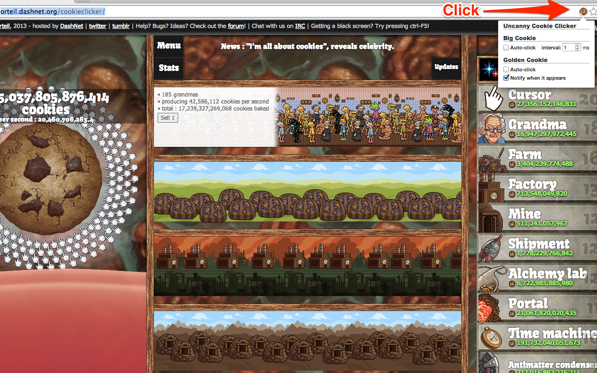

# Uncanny Cookie Clicker



[Uncanny Cookie Clicker][] is a [Chrome][] extension which helps you play
[Cookie Clicker][]. Currently supported features are:

- Auto-click the big cookie at given interval
- Auto-pop Wrinklers
- Auto-click a golden cookie when it appears (avoiding red cookies if you want)
- Notify you when a golden cookie appears
- Auto-buy upgrades and buildings
- Notify you when upgrades become available
- Speed up the game
- Auto-click and notify when a season popup appears

This extension also works on the [beta version of Cookie Clicker][].

## Supported versions

The following [versions of Cookie Clicker](https://cookieclicker.fandom.com/wiki/Version_History) are supported:

- 2.048 or above
- 2.047 (beta) or above

[Uncanny Cookie Clicker]: https://chrome.google.com/webstore/detail/uncanny-cookie-clicker/mmmdenlpgbgmeofmdkhimecmkcgabgno
    "Uncanny Cookie Clicker"

[Chrome]: https://www.google.com/chrome
    "Chrome Browser"

[Cookie Clicker]: http://orteil.dashnet.org/cookieclicker/
    "Cookie Clicker"

## Publishing

Extensions must be compressed into a zip file to publish to the
[Chrome Web Store][].
`pack.sh` is a helper script for compressing extensions used as below.

``` bash
$ cd /path/to/repo
$ ./pack.sh src
```

[Chrome Web Store]: https://chrome.google.com/webstore/

## Implementation note

- Directory structure and messaging module for communication between
  background part and content script are inspired by [chrome-skeleton][].
- Bi-directional messaging between scripts dynamically injected in a page
  and background part is implemented.

[chrome-skeleton]: https://github.com/salsita/chrome-skeleton
    "salsita/chrome-skeleton"

## External libraries

- [Bootstrap](http://getbootstrap.com/) (v3.0.0)
- [jQuery](http://jquery.com/) (v1.10.2)
- [Underscore](https://github.com/amdjs/underscore/) (v1.4.1, AMD compatible fork)
- [Watch.JS](https://github.com/melanke/Watch.JS) (v1.3.0)

## Authors

- [Naoto Yokoyama](https://github.com/builtinnya) - the original author
- [Gray-Wind](https://github.com/Gray-Wind) - support season popups
- [Petrie Wong](https://github.com/petriewong) - update auto click golden cookies for v2.002
- [mendel3](https://github.com/mendel3) - Add HTTPS support

## License

Copyright (c) 2013-2023 Naoto Yokoyama.
Distributed under the MIT License.
See the file LICENSE.
